# 03 端到端延迟预算：每一段花了多少

> 用户说完到机器人开口，超过一秒就觉得慢，超过两秒就觉得坏了。这一秒要分给六七个环节。做预算，然后对着预算优化，比"感觉慢了就调"有效得多。

## 学习目标

- 能列出用户说完到听到第一个字之间的每一段，并给出典型耗时区间
- 能说出每一段的主要优化手段和它的代价
- 能解释为什么"首字延迟"和"总时长"要分开优化

## 心智模型

```mermaid
gantt
    title 用户说完 → 机器人开口（典型 pipeline，单位 ms）
    dateFormat X
    axisFormat %L
    section 感知
    轮次判定（静音等待）      :0, 400
    ASR 最终结果             :400, 600
    section 思考
    上下文组装 + 网络         :600, 700
    LLM 首 token（TTFT）      :700, 1200
    首句生成完成              :1200, 1500
    section 表达
    TTS 首块音频              :1500, 1800
    播放缓冲 + 传输           :1800, 1900
```

## 要点

1. **预算从"用户最后一个音节"开始算，不是从 ASR 结果开始。** 轮次判定的静音等待本身就是几百毫秒，用户感知得到。
2. **轮次判定（300～800ms）是第一大块，也是最难压的。** 缩短等待会误切用户，加语义判断（这句话像说完了吗）可以在 200ms 左右就判定，但需要模型或规则。
3. **ASR 最终结果（100～300ms）可以靠流式中间结果掩盖。** 中间结果出来就开始准备下一步，最终结果到了再确认。这是第 01 篇要点 5。
4. **LLM 的 TTFT（300～800ms）取决于输入长度和模型大小。** 压它的手段：裁上下文（第 08 课）、用 prompt caching 让 system prompt 和工具定义命中缓存、选更小的模型、在 ASR 中间结果阶段就预热连接。
5. **首句生成（200～400ms）取决于第一个可合成片段多长。** 让模型先说短句是 prompt 层面的事："先用一句话回应，再展开"。
6. **TTS 首块（150～400ms）看供应商和是否流式。** 流式 TTS 是必需品，非流式的等整段合成完才能播是不可接受的。
7. **网络往返每一跳 20～100ms，跳数多了就是几百毫秒。** 设备 → 边缘 → ASR → Agent → LLM → TTS → 设备，能合并的合并，能就近部署的就近。
8. **总时长和首字延迟分开优化。** 首字延迟决定"机器人有没有反应"，总时长决定"它说话快不快"。后者由 TTS 语速和 LLM 吐字速度决定，通常不是瓶颈。
9. **预算要按 P95 定，不按平均。** 平均 800ms、P95 2.5 秒的系统，每二十次对话就有一次让用户觉得坏了。第 07 篇讲怎么测分布。
10. **每一段都要能单独测量。** 没有分段埋点，优化就是猜。作者的语音机器人项目在每个阶段边界打 trace span，第 18 课的可观测性在语音场景不是加分项，是能不能优化的前提。

## 一个可参考的目标预算

| 环节 | 目标 P95 | 主要手段 |
|---|---|---|
| 轮次判定 | ≤ 400ms | 语义 endpointing，静音阈值分场景 |
| ASR 最终结果 | ≤ 200ms | 流式中间结果预热下游 |
| LLM TTFT | ≤ 500ms | 裁上下文、prompt caching、小模型分流 |
| 首句可合成 | ≤ 300ms | prompt 要求短句开头 |
| TTS 首块 | ≤ 250ms | 流式 TTS，预连接 |
| 传输与缓冲 | ≤ 150ms | 就近部署，小缓冲 |
| **合计** | **≤ 1.8s** | |

这是一个可达但需要努力的目标。达不到时先看哪一段最偏离，不要平均用力。

## 和主线的关系

- TTFT 与上下文长度、prompt caching → [第 08 课](../../lessons/08-context-engineering-for-agents/README.md)、[前置 F06 KV Cache 与推理](../../prerequisites/llm-foundations/06-kv-cache-and-inference/README.md)。
- 分段测量 → [第 18 课 可观测性](../../lessons/18-observability/README.md)。
- 延迟作为设计约束 → [原则 10](../../principles/10-cost-and-latency-are-design-constraints.md)。

## 延伸阅读

- [LiveKit Agents 文档](https://docs.livekit.io/agents/)（访问日期 2026-09-04）：pipeline 各阶段的实现和可插拔组件。
- [OpenAI Realtime API 指南](https://platform.openai.com/docs/guides/realtime)（访问日期 2026-09-04）：Realtime 形态把中间几段合并后，延迟预算长什么样。

---

[← 02](./02-interruption-and-backpressure.md) · [04 →](./04-dual-model-racing.md)
