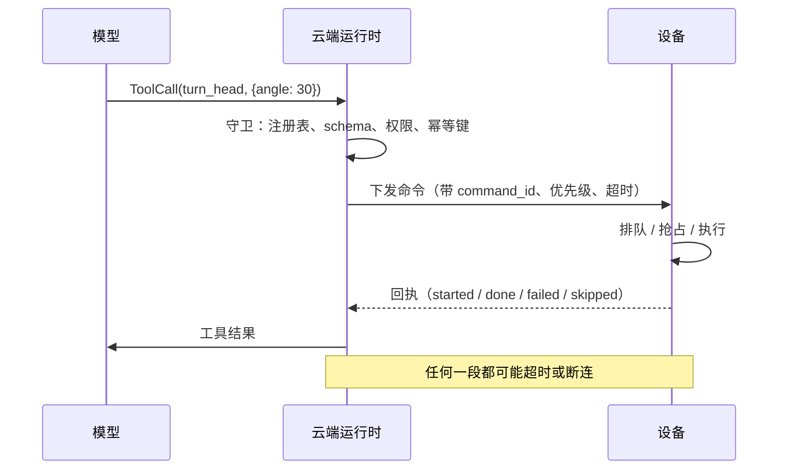

# 05 设备端工具下发：当工具会动

> 云上的 Agent 决定"转头看用户"，这条命令要穿过网络到设备，设备执行，结果再回来。它是第 05 课的工具调用，只是工具在另一台机器上，而且会产生物理动作。

## 学习目标

- 能画出一条设备命令从模型输出到执行回执的完整链路，标出每一段可能丢失或重复的地方
- 能为一个动作命令设计契约：参数、优先级、超时、回执、幂等
- 能说出"设备状态"和"Agent 认为的设备状态"为什么会不一致，以及怎么处理

## 心智模型

## 要点

1. **设备命令是有副作用的工具，而且副作用不可撤销。** 头转了就是转了。第 05 课的确认门和幂等键在这里不是可选项。
2. **命令契约至少包含：类型、参数、command_id、优先级、超时、是否可被抢占。** 缺一个，设备端就得自己猜，猜错就是诡异行为。
3. **优先级和抢占是设备端的事，云端只声明。** 用户说"停"的命令必须能打断正在执行的舞蹈；一个"眨眼"的表情命令不该打断"讲故事"的语音。设备端维护一个带优先级的执行队列。
4. **回执要分阶段：收到、开始、完成、失败、跳过。** 只有"完成"一种回执，云端就分不清"设备没收到"和"设备在执行"。第 07 课的事件线程正好记这些。
5. **超时后云端不知道命令是否执行了。** 这是分布式系统的基本约束。处理方式是带同一个 command_id 重发，设备端按 id 去重（幂等），或者查询设备当前状态来推断。
6. **设备状态的权威在设备，不在云端。** 云端缓存的"当前音量 50%"可能已经过时（用户手动按了按键）。需要精确状态时问设备，不要信缓存。这是原则 05 的"业务状态权威在业务系统"。
7. **命令的语义要对模型友好，对设备精确。** 模型输出 `turn_head(direction="toward_user")`，运行时翻译成设备理解的角度。两层契约：模型层的意图，设备层的参数。翻译在运行时，不在模型也不在设备。
8. **批量和顺序。** 模型一轮可能输出多个动作（"点头，然后说好的"）。哪些并行、哪些顺序、失败一个要不要继续，是运行时的编排问题，不能扔给设备。
9. **网络断开时的降级。** 设备要有本地兜底：断网时至少能响应"停"、能播放预置的"网络不太好"。云端要有断连检测，不能对着一个不在线的设备一直发命令。
10. **安全边界由设备端的确定性代码执行。** 电机角度上限、移动速度上限、禁止区域，这些写在固件里，云端命令超限直接拒绝并回执 failed。模型永远不应该有能力让设备做出物理上危险的动作，无论 prompt 怎么写。这是原则 11 在物理世界的版本。

## 和主线的关系

- 契约、幂等、确认 → [第 05 课](../../lessons/05-tool-calling/README.md)。
- 分阶段回执进事件线程 → [第 07 课](../../lessons/07-agent-state-and-runtime/README.md)。
- 状态权威 → [原则 05](../../principles/05-runtime-owns-state.md)；安全边界在代码 → [原则 11](../../principles/11-guardrails-in-code-not-prompts.md)。
- 超时与重试 → [第 19 课](../../lessons/19-reliability-cost-llmops/README.md)。

## 延伸阅读

- [12-factor-agents · factor 04 Tools are structured outputs](https://github.com/humanlayer/12-factor-agents/blob/main/content/factor-04-tools-are-structured-outputs.md)（访问日期 2026-09-04）："模型决定做什么，代码决定怎么做"在设备场景就是两层契约。
- [MQTT 规范概述](https://mqtt.org/)（访问日期 2026-09-04）：设备命令下发最常见的传输协议，看 QoS 等级和它与"至少一次 / 至多一次"语义的关系。

---

[← 04](./04-dual-model-racing.md) · [06 →](./06-embodied-state-and-safety.md)
