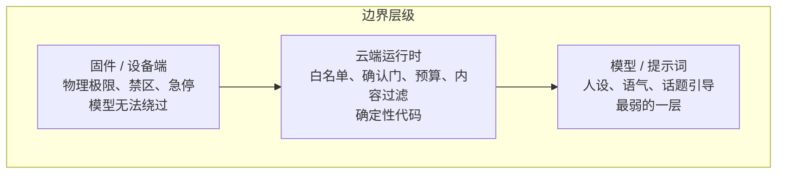

# 06 具身场景的状态与安全：动作不可撤销，用户可能是孩子

> 机器人 Agent 和聊天机器人的根本区别不是有没有麦克风，而是它的输出会改变物理世界，而且面对的用户可能不具备判断能力。这一篇讲这两件事对状态设计和安全边界的影响。

## 学习目标

- 能列出具身 Agent 比文本 Agent 多出来的状态类别，并说出各自的权威来源
- 能设计一个分级的安全边界：哪些由固件保证、哪些由运行时保证、哪些由模型保证
- 能解释为什么"静默退出"是一个必要的设计

## 心智模型

安全边界从下往上越来越弱。任何"绝对不能发生"的事，都必须在最下面那层保证。

## 要点

1. **多出来的状态：设备物理状态、环境感知状态、用户身份与在场状态、当前活动（讲故事 / 游戏 / 空闲）。** 前三个的权威在设备和传感器，最后一个在运行时。和对话状态、任务状态一样，都要分清谁是权威、多久过期。
2. **活动状态决定哪些工具可见。** 讲故事时不该暴露"开始游戏"的工具；游戏中途不该暴露"换个玩法"。这是第 05 课"按请求白名单"的具身版本：白名单跟着活动状态变。
3. **多个子 Agent 各管一种活动时，"当前是谁在管"本身是状态，而且要能从事件历史推出来。** 作者的项目曾把它单独存在一个对象里，和历史不一致后机器人反复问同一个问题。第 07 课的教训在这里代价更大，因为伴随着物理动作。
4. **物理动作没有撤销。** 所以确认门要更严：不可逆的动作（移动、大幅度转动）默认要确认或有预算；可逆的（表情、灯光、音量）可以直接做。分级要写成代码，不是 prompt。
5. **儿童用户改变一切假设。** 他们会说不完整的话、会重复、会被打断、会说出模型不该照做的要求。内容过滤要在运行时做，输出要在 TTS 之前过一遍，不能只靠模型的对齐。
6. **模型不能承认自己是 AI 这类人设要求，是产品决策，用 prompt 实现，但运行时要有兜底。** 比如检测到输出里出现"作为一个 AI"就拦截重生成。人设是最弱的一层，不能指望它每次都成立。
7. **静默退出是必要的工具。** 用户说"别说了"、"闭嘴"时，正确的反应是立刻安静，而不是说"好的，那我不说了"。作者的项目做了一个专门的退出工具：模型判断用户想结束时调用它，运行时收到后终止当前活动、不播任何声音。它比在提示词里写"用户说再见时停止"稳定得多，也是第 06 课"停止条件由运行时持有"的原型。
8. **感知输入也要过守卫。** 摄像头识别到"用户在场"可能是误识别；设备上报的状态可能是旧的。感知结果是建议，和模型输出一样不是事实。
9. **主动行为（机器人自己发起对话）要有节流和上下文。** 沉默不是错误，打扰才是。作者的项目为主动暖场加了显式的关闭开关和场景门禁，因为用户反馈"它太爱说话了"。
10. **事故复盘要能重放。** 一次"机器人突然转向撞到东西"必须能从事件线程、设备回执和 trace 里还原出是谁在哪一步做了什么决定。没有这个能力，安全就是口号。

## 和主线的关系

- 白名单随活动变 → [第 05 课](../../lessons/05-tool-calling/README.md)。
- 停止条件、退出工具 → [第 06 课](../../lessons/06-agent-loop/README.md)。
- 状态推导、事件线程 → [第 07 课](../../lessons/07-agent-state-and-runtime/README.md)。
- 内容过滤、边界在代码 → [第 20 课](../../lessons/20-security-governance/README.md)、[原则 11](../../principles/11-guardrails-in-code-not-prompts.md)。
- 可重放的事故复盘 → [第 18 课](../../lessons/18-observability/README.md)。

## 延伸阅读

- [OWASP Top 10 for LLM Applications](https://genai.owasp.org/llm-top-10/)（访问日期 2026-09-04）：Excessive Agency 那一条在具身场景里是物理风险。
- [12-factor-agents · factor 08 Own your control flow](https://github.com/humanlayer/12-factor-agents/blob/main/content/factor-08-own-your-control-flow.md)（访问日期 2026-09-04）：控制流自己拿着，在会动的系统里不是建议是底线。

---

[← 05](./05-device-tool-dispatch.md) · [07 →](./07-evaluating-voice-agents.md)
