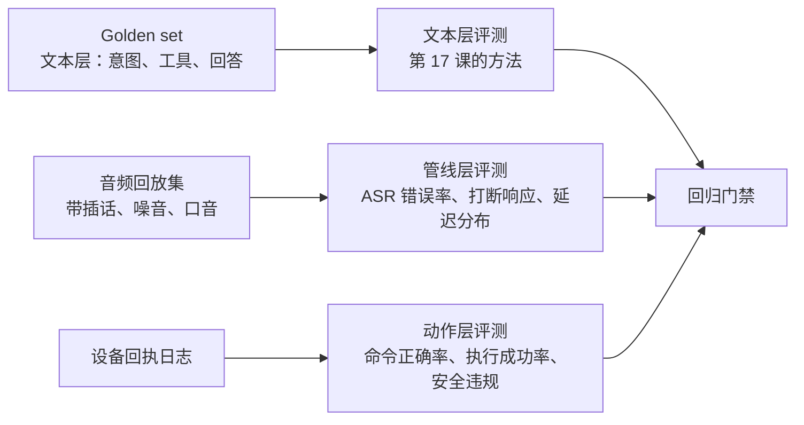

# 07 语音场景的评测：文本评测集不够用

> 文本 Agent 的评测是"输入一句话，看输出对不对"。语音 Agent 还要回答：ASR 听错了怎么办、打断响应快不快、延迟分布长什么样、物理动作对不对。这一篇讲怎么把这些变成可以自动跑的测试。

## 学习目标

- 能列出语音 Agent 评测比文本多出来的四个维度，并为每个维度设计至少一种可自动化的测量
- 能说出 ASR 错误注入的做法和它要回答的问题
- 能解释为什么延迟要看分布而不是平均，以及怎么在离线评测里得到分布

## 心智模型

## 要点

1. **第一层还是文本评测。** 给定 ASR 转出来的文本，Agent 该调哪个工具、该说什么。这和第 17 课完全一样，用 golden set 加 LLM judge。作者的项目用真 LLM 加假的存储和设备跑完整的 Agent 工作流，专门验证"该退出时退没退"这类坏案例。
2. **ASR 错误注入回答"听错一个字会怎样"。** 在 golden set 的输入上模拟典型 ASR 错误（同音字、漏字、断句错），看意图判定是否稳定。工具名或人名被听错是高发区。
3. **语义相近的口语变体要覆盖。** "小点声"、"太吵了"、"音量低一点"应该都触发同一个工具。文本评测集要按意图聚类，每个意图至少十几种说法，儿童说法单独一类。
4. **打断评测靠音频回放。** 录一批"机器人说话中途用户插话"的音频，回放进管线，测：检测到打断的延迟、播放停止的延迟、是否有残留音频、新一轮是否带上了被打断的上下文。
5. **延迟评测要出分布，不出平均。** 每次运行记录每一段的耗时，几百次之后画 P50 / P95 / P99。第 03 篇的预算按 P95 定，评测就按 P95 判。
6. **动作层评测看设备回执。** 命令有没有下发、参数对不对、设备有没有执行成功、有没有触发固件层的安全拒绝。安全拒绝出现一次就是一个必须查的案例，不是统计指标。
7. **回归门禁：每次改动跑三层，任何一层的关键指标下降就不合并。** 文本层准确率、打断 P95、动作成功率，三个数字加安全违规为零。
8. **flaky 是真实信号，不是噪音。** 作者的项目里"选中某个子 Agent 时点名不稳定"这个 flaky case，最后发现是提示词的两层契约有冲突。多跑几次找规律，不要重试到绿就合并。
9. **真机测试仍然必要，但只做最后一步。** 回放和注入覆盖 90% 的问题，剩下的回声、麦克风增益、扬声器失真只有真机能暴露。每个版本在真机上过一遍固定脚本，不做探索性测试。
10. **评测数据要能从生产日志里长出来。** 每一次用户没得到正确响应的对话，脱敏后进 golden set。评测集不是一次性建的，是持续维护的。

## 和主线的关系

- 文本层评测 → [第 17 课 评测](../../lessons/17-evaluation/README.md)。
- 延迟分布、分段埋点 → [第 18 课 可观测性](../../lessons/18-observability/README.md)、本 track 第 03 篇。
- 用真 LLM 加假存储跑工作流 → 第 17 课的 Agent 轨迹评测。
- 回归门禁 → [原则 08](../../principles/08-no-eval-no-improvement.md)。

## 延伸阅读

- [Hamel Husain · Your AI Product Needs Evals](https://hamel.dev/blog/posts/evals/)（访问日期 2026-09-04）：评测集怎么从真实失败里长出来，语音场景一样适用。
- [LiveKit Agents 文档](https://docs.livekit.io/agents/)（访问日期 2026-09-04）：看它的测试与评测相关章节，pipeline 各段可以单独打桩。

---

[← 06](./06-embodied-state-and-safety.md) · [Track 目录](./README.md)
